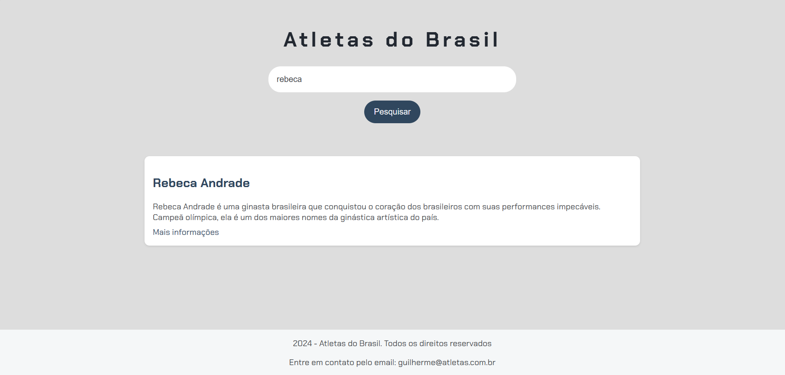
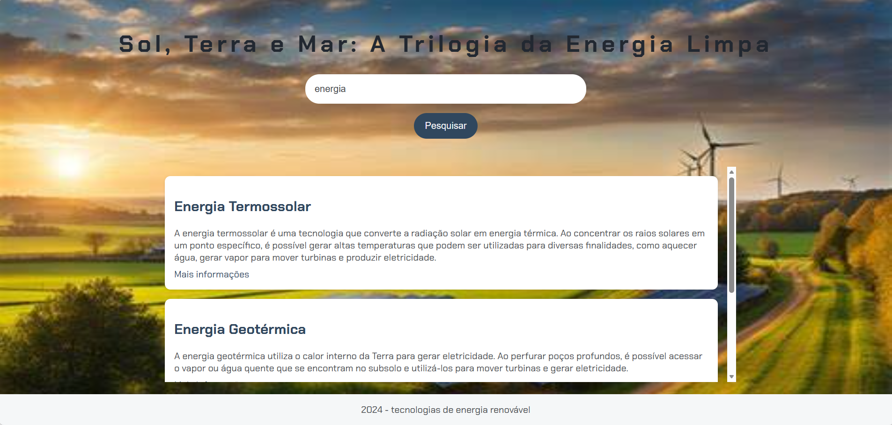

# 🚀 Imersão Dev com Google Gemini (Alura)

Este repositório reúne os projetos desenvolvidos durante a **Imersão Dev**, uma iniciativa da **Alura** em parceria com o **Google**. O foco principal foi a aplicação prática de lógica de programação, manipulação dinâmica de dados e estruturação de interfaces modernas utilizando JavaScript.

O repositório apresenta tanto o projeto base desenvolvido em aula quanto a minha aplicação personalizada, o **Gaia Energy**, onde apliquei os conceitos de forma autoral.

---

## 🏗️ 1. Projeto de Aula: Motor de Busca de Atletas

Desenvolvido durante as sessões guiadas, este projeto serviu como base para compreender a estrutura fundamental de um sistema de busca funcional no Front-End.

### 📸 Preview do Projeto de Aula

<p align="center">
  
</p>

---

- **Objetivo**: Criar uma interface simples para busca de informações sobre atletas brasileiros.  
- **Funcionalidades**: Filtragem de dados e exibição de resultados em tempo real.  
- **Foco Técnico**: Manipulação do DOM e integração básica entre arquivos JS e HTML.  

---

## 🌿 2. Projeto Autoral: Gaia Energy (Trilogia da Energia Limpa)

Baseado nos conhecimentos da imersão e com o auxílio do **Google Gemini** para estruturação e geração de ideias, desenvolvi o **Gaia Energy**. Este projeto foca na disseminação de informações sobre tecnologias de energia renovável.

### 📸 Preview do Gaia Energy

<p align="center">
  
</p>

---

### 🚀 Funcionalidades

- **Busca por Palavras-Chave**: Sistema de pesquisa que varre títulos, descrições e tags (como "ondas", "sol", "calor").  
- **Base de Dados Sustentável**: Informações detalhadas sobre Energia Termossolar, Geotérmica e Marítima.  
- **Feedback Dinâmico**: Mensagens de erro caso a busca seja vazia ou nenhum resultado seja encontrado.  
- **Interface Moderna**: Uso da fonte *Chakra Petch* e design focado na experiência do usuário.  

---

## 🛠️ Tecnologias Utilizadas

- **HTML5**: Estruturação semântica da aplicação  
- **CSS3**: Estilização com foco em responsividade (Mobile First)  
- **JavaScript (Vanilla JS)**: Lógica de busca, normalização de strings e renderização dinâmica  

---

## 🧠 Aprendizados e Evolução

Neste repositório, demonstro a evolução das minhas habilidades técnicas como desenvolvedor Front-End:

- **Lógica de Programação**: Implementação de algoritmos de busca e filtros eficientes  
- **Manipulação de DOM**: Criação e alteração de elementos HTML dinamicamente com `innerHTML`  
- **Responsividade**: Adaptação de layouts para diferentes resoluções de tela via `@media queries`  
- **Engenharia de Prompt**: Uso estratégico de IA para auxiliar na resolução de problemas e estruturação técnica  

---

## 📁 Estrutura do Repositório

```text
📦 Curso-Alura-Google-JavaScript
 ┣ 📂 Projeto_Aula       # Arquivos base desenvolvidos em aula
 ┣ 📂 Gaia_Energy        # Projeto autoral personalizado
 ┃ ┣ 📄 index.html      # Estrutura principal
 ┃ ┣ 📄 style.css       # Estilização e media queries
 ┃ ┣ 📄 app.js          # Lógica do motor de busca
 ┃ ┗ 📄 dados.js        # Objeto com a base de conhecimento
 ┗ 📄 README.md
```

## 🔧 Como Executar o Projeto

Clone o repositório:

```bash
git clone https://github.com/Lukinhax/Curso-Alura-Google-JavaScript.git
```

Acesse a pasta do projeto:

Navegue até o diretório desejado (Ex: `Gaia_Energy` ou `Projeto_Aula`).

Abra o arquivo principal:

Localize o arquivo `index.html` e abra-o em qualquer navegador moderno.

---

## 🎯 Objetivo do Projeto

Este repositório foi criado para consolidar habilidades em consumo de dados, desenvolvimento Front-End responsivo e integração com ferramentas de IA, como parte da minha trajetória acadêmica em Sistemas de Informação no IFSP.

---

## 📌 Status do Projeto

✔️ Finalizado

🚀 Pode receber melhorias futuras
